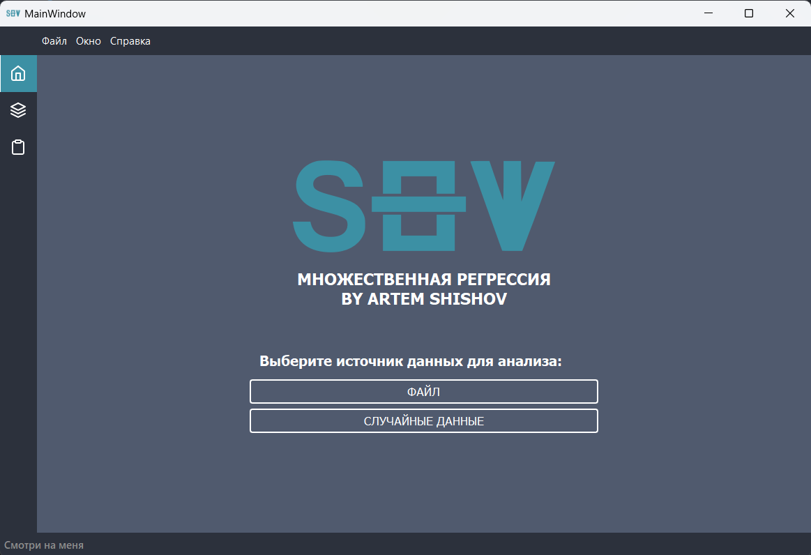

---

# Interactive Stepwise Regression UI

[](https://opensource.org/licenses/MIT)
[](https://www.python.org/)
[](https://github.com/psf/black)

Интерактивная desktop-платформа с графическим интерфейсом для визуального исследования процесса пошагового отбора переменных в модели множественной линейной регрессии.



## Возможности

*   **Визуальный анализ:** Интерактивный интерфейс для пошагового (вперед/назад) отбора переменных.
*   **Два алгоритма:** Реализованы методы обратного исключения и прямого включения переменных.
*   **Графики:** Визуализация ключевых метрик (R², F-статистика, ошибки предсказания) на каждом шаге.
*   **Работа с данными:** Загрузка данных из `.xlsx` файлов.
*   **Экспорт результатов:** Сохранение детального отчета о процессе анализа в `.rep` файл.

## Установка и запуск

1.  **Клонируйте репозиторий:**
    ```bash
    git clone https://github.com/suaviludius/interactive-stepwise-regression-ui.git
    cd interactive-stepwise-regression-ui
    ```

2.  **Установите зависимости:**
    Рекомендуется использовать виртуальное окружение.
    ```bash
    pip install -r requirements.txt
    ```

3.  **Запустите приложение:**
    ```bash
    python -m src.main
    ```

## Использование

1.  Запустите приложение.
2.  Нажмите "Выбрать файл" и укажите `.xlsx` файл с данными. Столбцы с независимыми переменными должны идти первыми, зависимые - последними.
3.  В доке "Анализ" выберите количество зависимых переменных и конкретную переменную для анализа.
4.  Используйте кнопки "Вперед" и "Назад" для пошагового выполнения алгоритма.
5.  Наблюдайте за изменением статистик и графиков в реальном времени.
6.  Для сохранения результатов нажмите "Создать отчет" в соответствующей вкладке.

## Структура проекта

```
interactive-stepwise-regression-ui/
├── data/                            # Папка для данных
│   ├── example1.xlsx                # Пример набора данных
|   └── example1.rep                 # Пример отчета по набору данн
├── docs/                            # Дополнительная документация
├── src/                             # Исходный код
│   ├── core/                        # Вычислительное ядро
│   │   ├── __init__.py
│   │   └── regression_core.py
│   ├── ui/                          # Графический интерфейс
│   │   ├── __init__.py
│   │   ├── file_handler.py
│   │   ├── frameless_window.py
│   │   ├── styles.py
│   │   ├── interface.py             # Сгенерированный из .ui файла
│   │   ├── resources.py             # Скомпилированный из .qrc файла
│   │   └── resources/               # Исходные ресурсы (.ui, .qrc, иконки)
│   │       ├── interface.ui
│   │       ├── resources.qrc
│   │       └── Logo/
│   │           └── SHV_icon.svg
│   └── main.py                      # Точка входа
├── tests/                           # ТЕСТЫ (теперь здесь будет код)
│   ├── __init__.py
│   ├── conftest.py                  # Фикстуры для pytest
│   ├── test_regression_core.py      # Тесты для ядра
│   └── test_ui_integration.py       # Интеграционные тесты UI
├── .gitignore                       # Шаблон для Python/PyQt
├── LICENSE                          # Лицензия
├── requirements.txt                 # Зависимости
└── README.md                        # Документация
```

## Технологический стек

*   **Python 3.8+**
*   **PyQt5** - фреймворк для построения desktop-интерфейса.
*   **NumPy** - вычисления и работа с линейной алгеброй.
*   **Pandas** - загрузка и обработка данных.
*   **Matplotlib** - построение графиков внутри приложения.

## Разработка

В процессе разработки ...

### Запуск тестов

```bash
python -m pytest tests/ -v