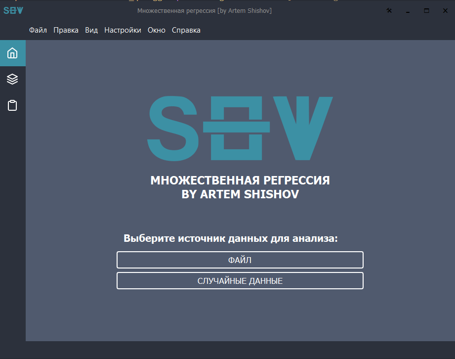

---

# Interactive Stepwise Regression UI

[](https://www.python.org/)
[](https://www.riverbankcomputing.com/software/pyqt/)
[](LICENSE)

**Интерактивная desktop-платформа для визуального исследования процесса пошагового отбора переменных в модели множественной линейной регрессии.** Сочетает вычислительное ядро на NumPy с современным графическим интерфейсом на PyQt5.



## ✨ Особенности

### 🧮 Вычислительное ядро (`regression_core.py`)
- **Полная реализация МНК:** Матричные вычисления для точного построения моделей множественной регрессии
- **Два алгоритма отбора:** Прямое включение (Forward Selection) и обратное исключение (Backward Elimination)
- **Все ключевые статистики:** Расчет R², скорректированного R², F-статистики, p-value, дисперсий, стандартных ошибок
- **Интеллектуальный выбор переменных:** Автоматическое определение наиболее значимых/незначимых факторов на каждом шаге
- **Система отката (backup):** Возможность шагать назад и вперед по процессу отбора

### 🖥️ Графический интерфейс (`main.py`)
- **Современный интерфейс:** Кастомное безрамочное окно с темной темой
- **Интерактивная визуализация:** Графики в реальном времени показывают изменение статистик на каждом шаге
- **Полный контроль:** Возможность ручного вмешательства в автоматический процесс
- **Встроенный проводник:** Загрузка данных прямо из Excel-файлов (.xlsx)
- **Генерация отчетов:** Экспорт полных результатов анализа в текстовые файлы

## 📦 Установка

1. **Клонируйте репозиторий:**
```bash
git clone https://github.com/your-username/stepwise-regression-explorer.git
cd stepwise-regression-explorer
```

2. **Установите зависимости:**
```bash
pip install -r requirements.txt
```

3. **Запустите приложение:**
```bash
python src/main.py
```

## 🚀 Быстрый старт

1. **Загрузка данных:** Нажмите "Выбрать файл" и укажите ваш Excel-файл с данными
2. **Настройка модели:** Выберите количество и конкретную зависимую переменную Y
3. **Выбор режима:** 
   - *Автоматический:* Программа сама выберет оптимальный порядок отбора
   - *Ручной:* Вы сами решаете, какие переменные добавлять/удалять
4. **Анализ:** Используйте кнопки "Шаг вперед" и "Шаг назад" для навигации
5. **Визуализация:** Наблюдайте за изменением графиков и статистик в реальном времени
6. **Экспорт:** Сохраните подробный отчет о проведенном анализе

## 🏗️ Архитектура проекта

```
src/
├── core/                    # Вычислительное ядро
│   ├── engine.py           # StepwiseRegressionEngine - основная логика
│   └── statistics.py       # Статистические расчеты
├── ui/                     # Графический интерфейс
│   ├── main_window.py      # Главное окно приложения
│   ├── frameless_window.py # Кастомное безрамочное окно
│   └── styles.py           # Стилизация интерфейса
└── main.py                 # Точка входа
```

## 📊 Поддерживаемые статистические метрики

- **Коэффициенты регрессии (REE)** - Оцененные параметры модели
- **R² (коэффициент детерминации)** - Объясненная дисперсия модели
- **F-статистика (FSKF)** - Общая значимость модели
- **Стандартные ошибки (Y_S)** - Точность оценок
- **Остатки (E)** - Разницы между предсказанными и фактическими значениями
- **Дисперсионно-ковариационная матрица (K)** - Оценки точности коэффициентов

## 🔧 Технические требования

- **Python:** 3.8 или выше
- **Основные зависимости:** 
  - `PyQt5 >= 5.15` - Графический интерфейс
  - `numpy >= 1.21` - Матричные вычисления
  - `pandas >= 1.3` - Работа с данными
  - `matplotlib >= 3.5` - Визуализация
  - `openpyxl >= 3.0` - Чтение Excel-файлов

## 📚 Методология

Проект реализует классические методы пошагового регрессионного анализа:

1. **Прямое включение:** Начинается с пустой модели, на каждом шаге добавляется переменная с наибольшим улучшением F-статистики
2. **Обратное исключение:** Начинается с полной модели, на каждом шаге удаляется переменная с наименьшим вкладом в R²
3. **Комбинированный подход:** Сочетание двух методов для оптимального результата

## 👨‍💻 Разработчикам

Проект использует модульную архитектуру:

```python
# Пример использования вычислительного ядра
from src.core.engine import StepwiseRegressionEngine

# Инициализация с данными
engine = StepwiseRegressionEngine('data.xlsx', sheet_number=1)
engine.read_excel(dependent_vars_count=1)

# Запуск автоматического отбора
engine.auto_stepwise_selection()

# Получение результатов
print(f"Final R²: {engine.R2}")
print(f"Selected variables: {engine.IndX_ADD}")
```

## 📄 Лицензия

Этот проект распространяется под лицензией MIT. Подробнее см. в файле [LICENSE](LICENSE).

## 🤝 Участие в разработке

Contributions are welcome! Feel free to submit:
- Bug reports
- Feature requests
- Pull requests
- Documentation improvements

## 📞 Контакты

**Артем Шишов** - Разработчик  
- Email: powerranger1912@gmail.com  
- GitHub: [YourGitHub](https://github.com/your-username)

---

*Этот инструмент предназначен для исследователей, аналитиков и студентов, работающих с регрессионным анализом и отбором признаков.*